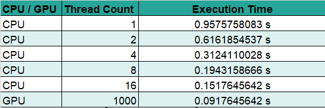

# GPU Asisted Parallelization of Nearest Neighbour Calculation

&nbsp;&nbsp;&nbsp;&nbsp;
This program executes sequential and parallel versions of [Nearest-Neighbour](https://en.wikipedia.org/wiki/Nearest_neighbor_search) calculation using both GPU parallelizm and CPU parallelizm,
outputs the execution times of sequential and parallel versions

**Implemented by:**

 * [M.Mucahid Benlioglu](https://github.com/mbenlioglu)

## Getting Started

### Data

&nbsp;&nbsp;&nbsp;&nbsp;
There are two sets of 16-dimensional points considered in this application, which will be referred as _train set_ and _test set_.
This application finds points from _training set_ having the shortest Euclidian distances to the points given in _test set_.

&nbsp;&nbsp;&nbsp;&nbsp;
To represent this two sets, 2 CSV files that have 16 columns of numbers, without any header rows, are considered. One of which will
represent the _train set_, and the other will represent the _test set_. There are 2 files under `./data/` directory provided, which
are used for the results shown here.

### Compiling

&nbsp;&nbsp;&nbsp;&nbsp;
The provided Makefile, `./Makefile` is to compile codes into executable in Linux environment. Executing following command in the
project root will create an executable named "nearestNeighbour" which takes zero, one or three arguments.

    $ make

&nbsp;&nbsp;&nbsp;&nbsp;
For Windows use Visual Studio with provided *.sln & *.vxproj files to compile the codes.

### Execution

&nbsp;&nbsp;&nbsp;&nbsp;
Compiled executable will run either with zero, one or three parameters. If zero parameters are provided, program will use device 0
as the GPU device and will try to input _train_ and _test_ sets from `./data/train.txt` and `./data/test.txt` respectively. (which
are provided) If 1 parameter is provided that will be used as the GPU device id and data files will be assumed in the same place as
before. If 3 parameters are provided, first parameter will be used for the path of _train set_ second will be used for _test set_
and third will be used for the GPU device id.

&nbsp;&nbsp;&nbsp;&nbsp;
The program will run sequential and parallel versions of the algorithm and output the execution times.

## Algorithm & Implementation

&nbsp;&nbsp;&nbsp;&nbsp;
To find closest point in _train set_ to a point in _test set_, Euclidian distances of the point in _test set_ to all points in
_train set_ must be checked, but since we are not interested in actual values of distances, we can omit square root part in the
calculation and just compare the sums of squares, to reduce the computational complexity.

&nbsp;&nbsp;&nbsp;&nbsp;
In both CPU and GPU parallelizm, closest neighbours of multiple points from _test set_ is calculated concurrently, but since number
of cores in GPU is significantly larger than CPU, we can find more neighbours in parallel, compared to CPU. Results can be seen in
the following sections.

### Observations and performance improvements

&nbsp;&nbsp;&nbsp;&nbsp;
A quick analysis of the provided data revealed that none of the dimensions in neither train nor test set exceeds **15**, which means
we can represent a dimension with at most 4 bits of information, or an entire point with 64 bits of information. Therefore, the first
realization was using regular 32-bit integers for every dimension would waste 8 times more space than we would need, even 8-bit
unsigned chars would cause a waste of space. Therefore, [bit fields](https://docs.microsoft.com/en-us/cpp/cpp/cpp-bit-fields) are used to
reduce memory consumption and increase the chances of fitting most of the data into fast memories to imporve performance.

## Results

&nbsp;&nbsp;&nbsp;&nbsp;
In this section, result tables containing various information about execution results is given.

**Table 1.** Execution time of the algortihm on GPU and CPU with different number of threads